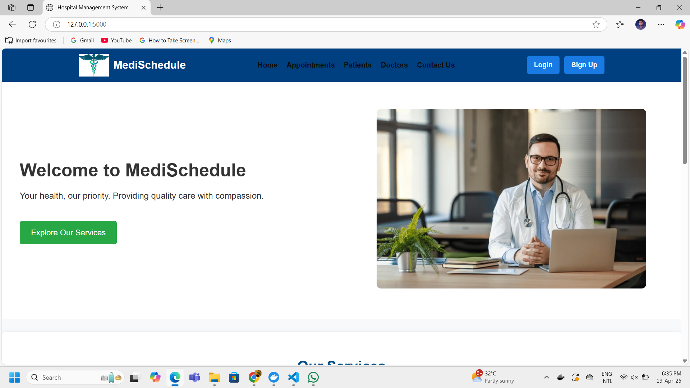
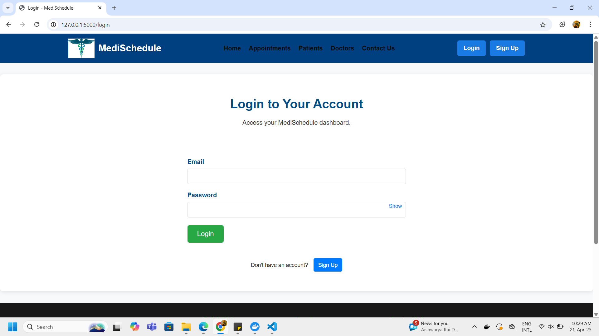
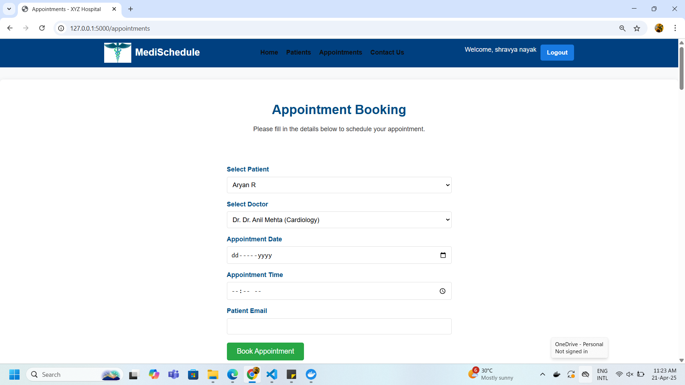
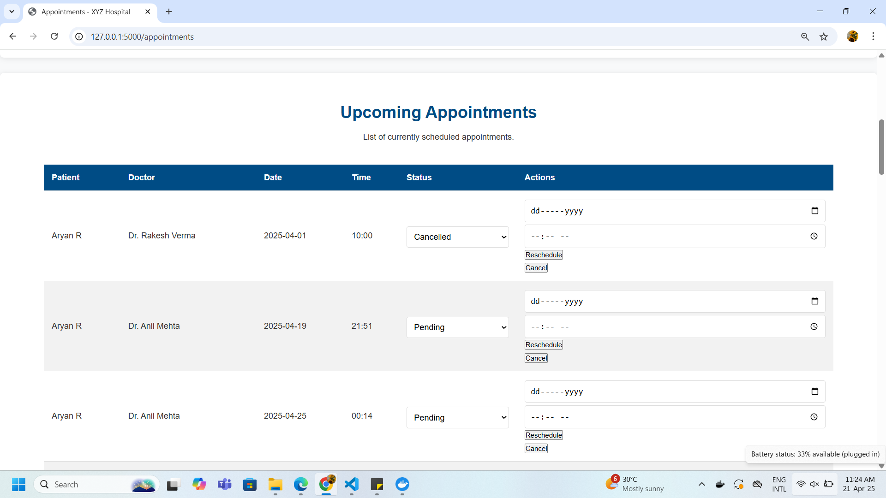

# 🩺 Doctor Appointment System

> A role-based web app to simplify booking, managing, and tracking doctor appointments with real-time email notifications.


A full-stack web application built using **Flask (Python)**, **MySQL**, **HTML**, and **CSS**, designed to streamline the process of booking and managing doctor appointments. This role-based system supports **Patients**, **Doctors**, and **Admins**, offering features like appointment scheduling, status tracking, profile management, and email notifications.

---

## 🚀 Features

### 🔐 Role-Based Authentication
- Patients, Doctors, and Admins can register and securely log in.
- Each user has access only to role-appropriate features.

### 📅 Appointment Management
- **Patients**: Book, reschedule, and cancel appointments.
- **Doctors**: View and update appointments.
- **Admins**: Full access to all appointments and user data.

### 🔄 Appointment Status Tracking
- Statuses include: `Pending`, `Completed`, `Cancelled`, and `Missed`.

### 📧 Email Notifications
- Real-time email alerts for:
  - Appointment confirmation  
  - Rescheduling updates  
  - Cancellations  
- Powered by **Flask-Mail** with Gmail SMTP.

### 🌐 Responsive Frontend
- Clean and user-friendly interface using custom **HTML & CSS**.
- Fully responsive across devices.

---

## 🛠️ Tech Stack

| Layer             | Technology                                                                                      |
|-------------------|------------------------------------------------------------------------------------------------|
| **Backend**       |   |
| **Frontend**      |       |
| **Database**      |       |
| **Email Service** |  
| **Version Control** |           |

---

## ⚙️ Installation Guide

### 📋 Prerequisites
- Python 3.8+
- MySQL Server
- Git

### 1. 📥 Clone the Repository
```bash
git clone https://github.com/shravyamnayak/dbms-project.git
cd dbms-project
```

### 2. 🧪 Set Up a Virtual Environment (Optional)
```bash
python -m venv venv
# On Linux/macOS
source venv/bin/activate

# On Windows
venv\Scripts\activate
```

### 3. 📦 Install Dependencies
```bash
pip install -r requirements.txt
```

### 4. 🗃️ Configure the MySQL Database
- Create a MySQL database named `doctors_appointment`.
- Ensure all required tables are created based on the schema.

### 5. ✉️ Configure Flask-Mail

```python
MAIL_SERVER = 'smtp.gmail.com'
MAIL_PORT = 587
MAIL_USE_TLS = True
MAIL_USERNAME = 'your-email@gmail.com'
MAIL_PASSWORD = 'your-app-password'
```

### 6. ▶️ Run the App
```bash
flask run
```

Access the app at: [http://127.0.0.1:5000](http://127.0.0.1:5000)

---

## 🖼️ Project Screenshots

Here are some key screens from the **Doctor Appointment System** showcasing the main features and UI:

<table>
  <tr>
    <td align="center" style="padding: 15px;">
      
      <br/>
      <strong>🏠 Home Page</strong>
      <p style="max-width: 280px; color: #555; font-style: italic; font-size: 0.9em;">
        Welcome screen with navigation to key features and quick info.
      </p>
    </td>
    <td align="center" style="padding: 15px;">
      
      <br/>
      <strong>🔐 Login Page</strong>
      <p style="max-width: 280px; color: #555; font-style: italic; font-size: 0.9em;">
        Secure login with email and password authentication.
      </p>
    </td>
  </tr>
  <tr>
    <td align="center" style="padding: 15px;">
      
      <br/>
      <strong>📅 Appointment Dashboard</strong>
      <p style="max-width: 280px; color: #555; font-style: italic; font-size: 0.9em;">
        View and manage your scheduled appointments easily.
      </p>
    </td>
    <td align="center" style="padding: 15px;">
      
      <br/>
      <strong>🔄 Reschedule Page</strong>
      <p style="max-width: 280px; color: #555; font-style: italic; font-size: 0.9em;">
        Easily reschedule appointments with just a few clicks.
      </p>
    </td>
  </tr>
</table>

---

## 🤝 Contributing
Contributions are welcome!
Feel free to open issues for bugs or feature requests, or submit pull requests.

Please adhere to the existing code style and add tests when applicable.

 ---
 
## 🌟 Future Enhancements

- 📱 **Mobile App Integration**: Cross-platform mobile apps for patients and doctors.
- 🔍 **Advanced Search & Filters**: Filter by specialization, date, and availability.
- ⭐ **Ratings & Feedback**: Let patients rate and review doctors.
- 💳 **Payment Integration**: Secure online payments for consultations.

---

## 📫 Contact
GitHub: shravyamnayak

Email: shravyamnayak@gmail.com

---
## 📄 License

This project is licensed under the **MIT License**.  
See the [LICENSE.md](LICENSE.md) file for details.

---

## 🔗 GitHub Repository

🔗 [GitHub – shravyamnayak/dbms-project](https://github.com/shravyamnayak/dbms-project)

---
If you want it in any other format (like pure text, no markdown, or HTML), just let me know!
